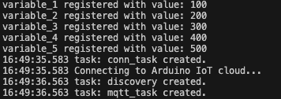
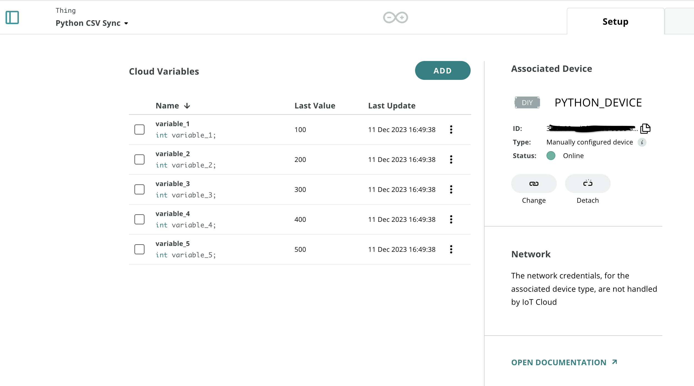

# ArduinoCloud-PythonCSV

Simple CSV and [Arduino Cloud](https://app.arduino.cc/) Python script that fetches data from a local CSV file and sends an update to the Arduino Cloud.

> Useful for e.g. mass switching things ON/OFF, by using [variable synchronisation](https://docs.arduino.cc/arduino-cloud/cloud-interface/variables#variable-synchronisation).

## Requirements

This project requires the [arduino-iot-cloud](https://pypi.org/project/arduino-iot-cloud/) package to be installed. You also need a [Arduino Cloud account](https://app.arduino.cc/).

## Setup

1. Install the [arduino-iot-cloud](https://pypi.org/project/arduino-iot-cloud/) package:

    ```sh
    pip install arduino-iot-cloud
    ```

2. Create an Arduino account, and go to [Arduino Cloud](https://app.arduino.cc/)
3. Create a Thing, and create the following variables:

    | Name       | Type |
    | ---------- | ---- |
    | variable_1 | int  |
    | variable_2 | int  |
    | variable_3 | int  |
    | variable_4 | int  |
    | variable_5 | int  |

    > These variables match the demo example, so name them exactly like this to avoid any manual changes.

4. In your Thing, create a **Manual Device**. This will generate a **Device ID** and **Secret Key**. Store these, cause they will be used in the script.
5. Open the script (available in the `/demo` folder), and replace the following lines with your Device ID / Secret Key:
   ```python
   DEVICE_ID = b"YOUR_DEVICE_ID"
   SECRET_KEY = b"YOUR_SECRET_KEY"
   ```
6. Create a file named `data.csv` and place it in the same folder as your script. This file is also available in this repository. The file has two columns, which are for the **variable** and the **value**. Like this:

    ```csv
    variable_1,50
    variable_2,100
    etc..
    ```

    Here you can fill in any values you want.

7. Launch the Python script. This should update all of your variables with the new values. On success, the terminal should show something like the following:



In the Arduino Cloud, you should see the values update:

